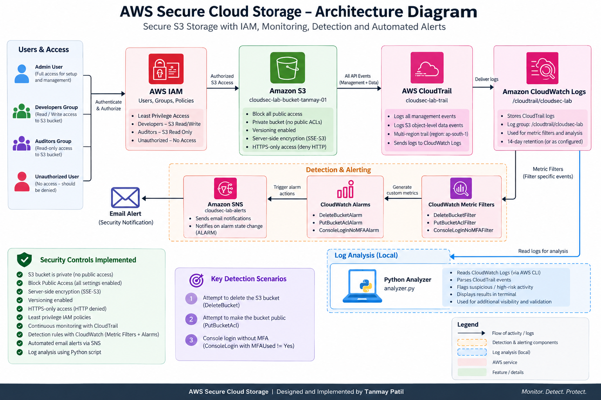

# AWS Secure Cloud Storage & Threat Detection

This project is a complete AWS security lab that secures an S3 storage environment, enforces IAM least privilege, monitors activity with CloudTrail and CloudWatch, generates SNS alerts for suspicious events, and analyzes CloudTrail logs with Python.

---

## Architecture

  

**Security flow**

`IAM → S3 → CloudTrail → CloudWatch Logs → Detection Filters → CloudWatch Alarms → SNS`

The Python analyzer queries CloudWatch Logs using `boto3` for additional analysis.

---

## Security Controls

| Area | Implementation |
|---|---|
| S3 | Block Public Access, HTTPS-only access, AES256 encryption, versioning |
| IAM | Developers, Auditors, and unauthorized-user validation |
| Monitoring | CloudTrail management and S3 data events |
| Detection | CloudWatch Metric Filters and Alarms |
| Alerting | Amazon SNS email notifications |
| Analysis | Python, boto3, pandas |

---

## Detection Rules

| Event | Alarm |
|---|---|
| `DeleteBucket` | `DeleteBucketAlarm` |
| `PutBucketAcl` | `PutBucketAclAlarm` |
| Console login without MFA | `ConsoleLoginNoMFAAlarm` |

---

## Validation

IAM validation

- Auditor bucket listing: Allowed
- Auditor object upload: Denied
- Unauthorized bucket access: Denied
- Public ACL attempt: Denied

[View IAM validation evidence](evidence/iam-least-privilege-validation.png)

Detection and alerting

All three configured detection paths were successfully triggered and verified through CloudWatch alarms and SNS notifications:

- DeleteBucket
- PutBucketAcl
- ConsoleLogin without MFA

[View detection filters](evidence/detection-metric-filters.png)  
[View alarm evidence](evidence/alarm-triggered-delete-bucket.png)

Python analyzer

The analyzer detected:

- Sensitive S3 actions as `HIGH`
- High API-call volume from a single source IP as `MEDIUM`

[View analyzer output](evidence/analyzer-output.png)

---

## Repository Structure

### Project files

- [README.md](README.md)

### Policies

- [policies/](policy/)
  - [bucket-policy.json](policy/bucket-policy.json)
  - [developers-policy.json](policy/developers-policy.json)
  - [auditors-policy.json](policy/auditors-policy.json)
  - [cloudtrail-cwl-trust-policy.json](policy/cloudtrail-cwl-trust-policy.json)
  - [cloudtrail-cwl-permissions.json](policy/cloudtrail-cwl-permissions.json)

### Scripts

- [scripts/](script/)
  - [analyzer.py](script/analyzer.py)
  - [cleanup.sh](script/cleanup.sh)

### Tests

- [tests/](tests/)
  - [validation-matrix.md](tests/validation-matrix.md)

### Evidence

- [evidence/](evidence/)
  - [architecture.png](evidence/architecture.png)
  - [environment-admin-identity.png](evidence/environment-admin-identity.png)
  - [environment-cloudtrail-active.png](evidence/environment-cloudtrail-active.png)
  - [s3-public-access-block.png](evidence/s3-public-access-block.png)
  - [s3-https-only-validation.png](evidence/s3-https-only-validation.png)
  - [s3-encryption-versioning.png](evidence/s3-encryption-versioning.png)
  - [iam-groups.png](evidence/iam-groups.png)
  - [iam-least-privilege-validation.png](evidence/iam-least-privilege-validation.png)
  - [cloudtrail-s3-data-events.png](evidence/cloudtrail-s3-data-events.png)
  - [cloudtrail-cloudwatch-integration.png](evidence/cloudtrail-cloudwatch-integration.png)
  - [detection-metric-filters.png](evidence/detection-metric-filters.png)
  - [alarm-triggered-delete-bucket.png](evidence/alarm-triggered-delete-bucket.png)
  - [alarm-triggered-put-bucket.png](evidence/alarm-triggered-put-bucket.png)
  - [alarm-triggered-no-mfa.png](evidence/alarm-triggered-no-mfa.png)
  - [sns-security-alert-delete-bucket.png](evidence/sns-security-alert-delete-bucket.png)
  - [sns-security-alert-put-bucket.png](evidence/sns-security-alert-put-bucket.png)
  - [sns-security-alert-no-mfa.png](evidence/sns-security-alert-no-mfa.png)
  - [analyzer-output.png](evidence/analyzer-output.png)

### Documentation

- [docs/](docs/)
  - [final-report.pdf](docs/final-report.pdf)

---

## Key Implementation Lessons

View lessons learned

- AWS service access requires explicit permissions where a service principal needs access.
- AWS CLI resource names are case-sensitive.
- PowerShell and Bash syntax differ.
- CloudTrail management events and S3 data events are separate.
- Versioned S3 buckets require removal of versions and delete markers before deletion.
- CloudWatch resources are regional.
- SNS notifications are tied to alarm state changes and do not necessarily generate a new email for every repeated matching event.

---

## Limitations

This is a controlled AWS security lab rather than a production deployment.

- Long-lived IAM credentials were used temporarily for the lab.
- Detection is implemented using CloudWatch filters and alarms.
- The Python analyzer is intentionally lightweight.
- S3 data events were enabled during testing and disabled during cleanup.

---

## Documentation

**[View the complete project documentation](docs/final-report.pdf)**

---

## Technologies

`AWS S3` · `AWS IAM` · `AWS CloudTrail` · `AWS CloudWatch` · `Amazon SNS` · `AWS CLI` · `Python` · `boto3` · `pandas`
